# Script-Multi-Table

# Bash Script For Generating a Multiplication table

## Objective:

### Create a Bash script that generate a multiplication table for a number entered by the user. this project will help you practice using loops, handling user input and applying conditional logic in Bash scripting.

## Project Description

### Your script should promt the user to enter a number and ask if they prefer to see a full multiplication table from 1 to 10 or a partial table within a specified range. Base on the user's choice, the script will display the corresponding multiplication table.

## Project Required:

## User input for number: 

### The script must first ask the user to input a number for which the multiplication table will be generated.

## Choice of Table Range:

### Next ask the use if they want a full multiplication table (1 to 10) or a partial table. If they choose partial, prompt them for the start and end of the range.

## Use Loops:

### Implement the logic to generate the multiplication table using loops. You may use either the list form or C-style for loops base on what's appropriate.

## Conditional Logic:

### Use if-else statements to handle the logic base on the user's choices (full vs partial table and valid range input).

## Input Validation: 

### Ensure the user enters valid numbers for the multiplication table and the specified range. Provide feedback for invalid inputs and default to a full table if the range is incorrect.

## Readable Output: 

### Display the multiplication table in a clear and readable format, adhering to the user's choice of range.

## Comments and Code Quality:

### Your script should be well-commented, explaining the purpose of different sectors and any important variables or logic used. Ensure the code is neatly formatted for easy readability.

## Example Script Flow:

1. Prompt the user to enter a number for the multiplication table

2. Ask if the want full table or a partial table

- if partial, prompt for the start and end number of the range

3. Validate the range inputs and handle invalid or out of bound entries.

4. Generate and display the multiplication table according to the specified range

5. Provide clear output formating for ease reading.

6. Enhance user interaction: Incooperate additional checks or features, like repeating the program for another number without restarting the script.

7. Creative Display Options: Offer different formatting styles for the table display and let the user choose.

## Project Summary

### This project is designed to be a practical application of bash scripting fundamentals, focusing on loops, conditional logic, and user input interaction. By completing this task, you will gain valuable experience in automating tasks and improving your scripting proficiency.

## Objective:

### Write a bash script that generates a multiplication table for a given number. The script should prompt the user to enter a number an then display the multiplication table for that number up to 10. Your task is to use both styles of for loops to achieve this: 
1. The list form and
2. The C-style form.

## Part 1: Using List Form For List

### Prompt the user: Your script should ask the user to input a number. Use the read command to capture this input into a variable.

### Generate Multiplication Table: Use a list form for loop to iterate through the numbers 1 to 10. In each iteration, calculate the product of the user's number and the iterator variable, then print the result in a clear format.

## Part 2: Using C-style For Loop

### Repeat the promt: You dont have need to ask the user again if you're making this a single script, just proceed with the C-style loop using same variable.

### Generate Multiplication Table with C-style Loop: Now write a C-style for loop to achieve the same task as in part 1. Compare how this approach differ from the list form loop in terms of syntax and clarity.

## Guidelines:

- Make sure the output is user-friendly and clearly formatted.

- Comment your code to explain which is using the list form an which part is using the C-style.

- Bonus: Ask the user if they want to see the table in ascending or descending order and implement this feature using if-else statements combine with your loop of choice.


# Project Implementation


## Creating multiplication-table.sh file and making the file executable.

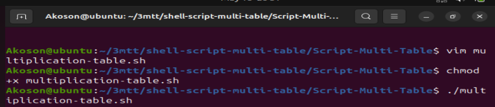


## multiplication table shell scripting screenshot:

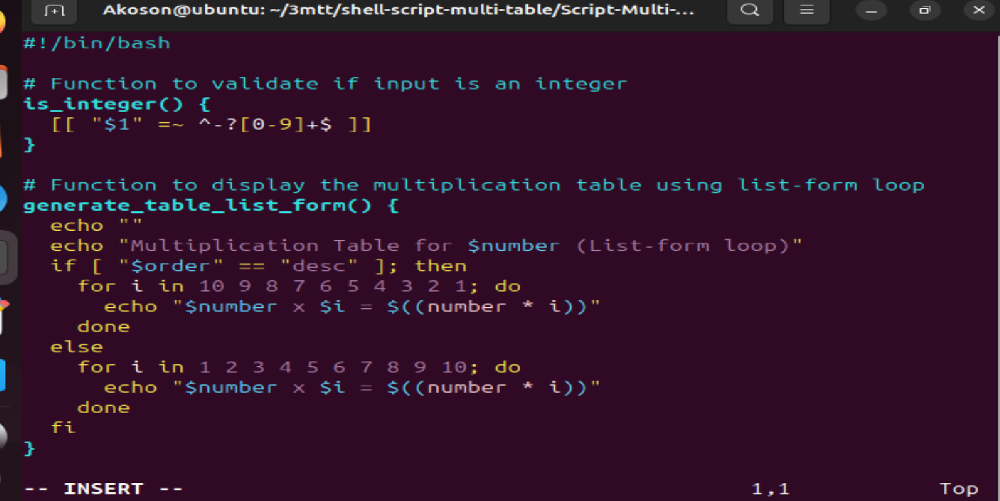

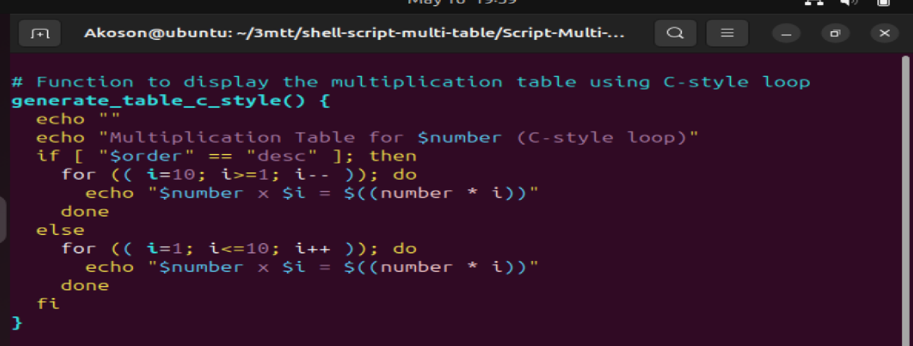

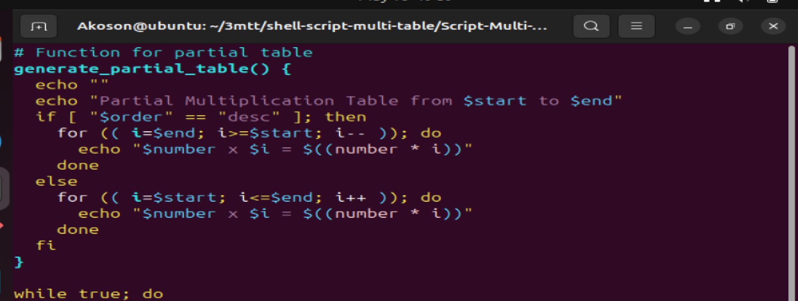

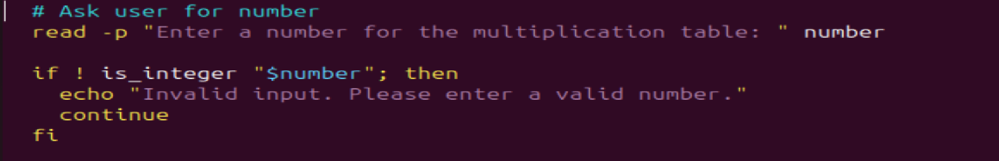

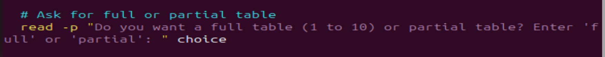

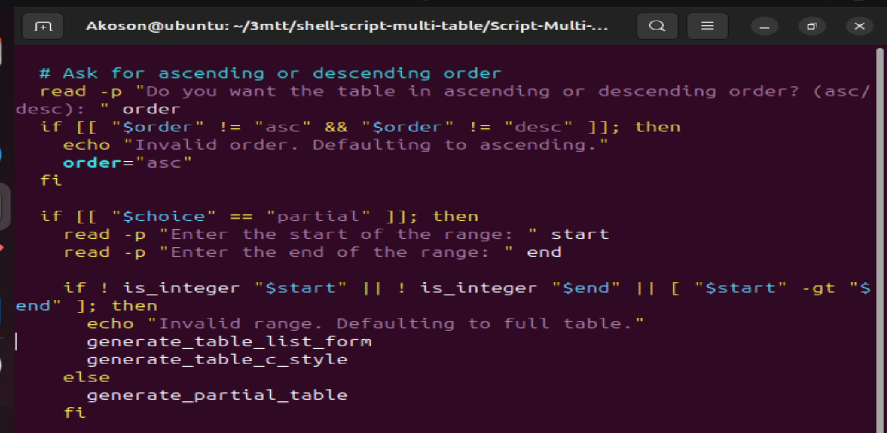

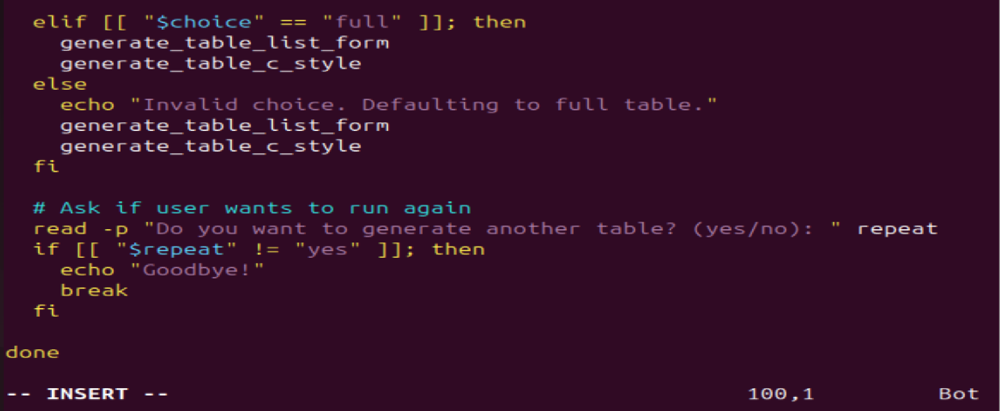


## Code output

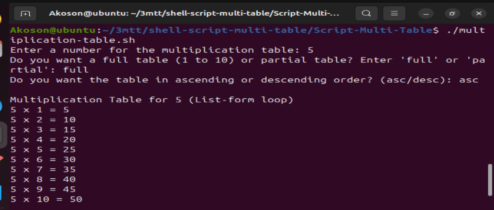

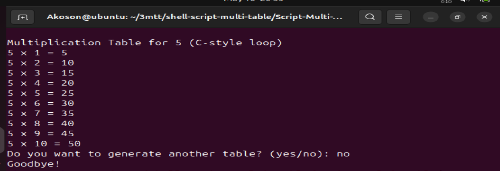

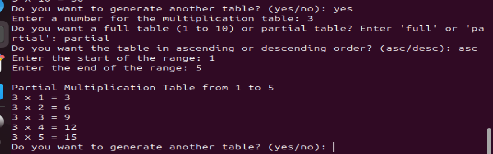

## Code Explanation

# Bash Multiplication Table Script

This Bash script allows users to generate a multiplication table for any number, with options for full or partial tables, ascending or descending order, and the use of both **list-form** and **C-style** `for` loops.

---

## Script Explanation (Line-by-Line)

```bash
#!/bin/bash
```
**Shebang** line: Tells the system to use the Bash shell to interpret the script.

---

```bash
# Function to validate if input is an integer
is_integer() {
  [[ "$1" =~ ^-?[0-9]+$ ]]
}
```
This function checks whether the input is a valid **integer** using a regular expression.

---

```bash
# Function to display the multiplication table using list-form loop
generate_table_list_form() {
  ...
}
```
This function uses the **list form of a `for` loop** to print the multiplication table for the user's number.

```bash
for i in 1 2 3 4 5 6 7 8 9 10; do
  echo "$number x $i = $((number * i))"
done
```
This is a **list-form `for` loop**: It explicitly lists all values from 1 to 10. Bash loops over each one.

If descending order is selected, it uses:

```bash
for i in 10 9 8 7 6 5 4 3 2 1; do
```

---

```bash
# Function to display the multiplication table using C-style loop
generate_table_c_style() {
  ...
}
```
This function uses the **C-style `for` loop**, which is more like loops in C, Java, or JavaScript:

```bash
for (( i=1; i<=10; i++ )); do
```
C-style loops include:
- Initialization: `i=1`
- Condition: `i<=10`
- Increment: `i++`

It allows more flexibility and compact control over the loop's behavior.

Descending C-style loop:

```bash
for (( i=10; i>=1; i-- )); do
```

---

```bash
# Function for partial table
generate_partial_table() {
  ...
}
```
Generates a table for a **custom start and end range** using C-style loop. It checks for ascending or descending display based on user choice.

---

### Main Execution Loop

```bash
while true; do
```
This loop allows the script to **keep running until the user chooses to exit**.

---

```bash
read -p "Enter a number for the multiplication table: " number
```
Prompts the user to **enter a number**, and stores it in the variable `number`.

---

```bash
if ! is_integer "$number"; then
  echo "Invalid input. Please enter a valid number."
  continue
fi
```
This checks if the input is not an integer using the earlier-defined `is_integer` function. If it's invalid, it asks again.

---

```bash
read -p "Do you want a full table (1 to 10) or partial table? Enter 'full' or 'partial': " choice
```
Asks the user whether they want a **full or partial** table.

---

```bash
read -p "Do you want the table in ascending or descending order? (asc/desc): " order
```
Takes user input for **output order**. If the value is invalid, it defaults to ascending:

```bash
if [[ "$order" != "asc" && "$order" != "desc" ]]; then
  echo "Invalid order. Defaulting to ascending."
  order="asc"
fi
```

---

### Partial vs Full Logic

```bash
if [[ "$choice" == "partial" ]]; then
  read -p "Enter the start of the range: " start
  read -p "Enter the end of the range: " end
```
Prompts for custom **start and end** values.

---

```bash
if ! is_integer "$start" || ! is_integer "$end" || [ "$start" -gt "$end" ]; then
  echo "Invalid range. Defaulting to full table."
  generate_table_list_form
  generate_table_c_style
else
  generate_partial_table
fi
```
Validates the custom range. If the range is invalid, defaults to the full table.

---

```bash
elif [[ "$choice" == "full" ]]; then
  generate_table_list_form
  generate_table_c_style
```
If full table is selected, it calls both `list-form` and `C-style` generation functions.

---

```bash
else
  echo "Invalid choice. Defaulting to full table."
  generate_table_list_form
  generate_table_c_style
```
Handles unrecognized input by defaulting to a full table.

---

### Repeating Script

```bash
read -p "Do you want to generate another table? (yes/no): " repeat
if [[ "$repeat" != "yes" ]]; then
  echo "Goodbye!"
  break
fi
```
Asks if the user wants to **generate another table**. If not, it breaks the `while` loop and ends the program.

---

## Summary of Syntax Used

| Feature         | Example                         | Description                        |
|----------------|----------------------------------|------------------------------------|
| Shebang         | `#!/bin/bash`                   | Tells the OS to use Bash           |
| Function        | `my_func() { ... }`             | Defines reusable code blocks       |
| Input           | `read -p`                       | Prompts and stores user input      |
| If condition    | `if [[ ... ]]`                  | Conditional branching              |
| List loop       | `for i in 1 2 3`                | Iterates over a list               |
| C-style loop    | `for (( i=1; i<=10; i++ ))`     | More flexible loop format          |
| Arithmetic      | `$(( ... ))`                    | Performs math in Bash              |
| Regex check     | `[[ "$var" =~ ... ]]`           | Input validation                   |
| While loop      | `while true; do ... done`       | Keeps repeating until break        |


# Comparison: C-style For Loop vs List-form For Loop in Bash

When writing loops in Bash, you have two main forms for `for` loops:

---

## 1. List-form `for` loop

### Syntax:
```bash
for var in value1 value2 value3 ...; do
  # Commands
done
```

### Example:
```bash
for i in 1 2 3 4 5; do
  echo "Number: $i"
done
```

### Advantages:
- **Simple and readable** when iterating over a known set of values.
- Best for looping over specific values (e.g., filenames, word lists, etc.).
- Useful when the sequence is irregular or predefined.

### Disadvantages:
- **Not dynamic** — the values must be listed explicitly or generated beforehand.
- Cannot handle ranges or conditions without external commands (e.g., `seq`).

---

## 2. C-style `for` loop

### Syntax:
```bash
for (( initialization; condition; increment )); do
  # Commands
done
```

### Example:
```bash
for (( i=1; i<=5; i++ )); do
  echo "Number: $i"
done
```

### Advantages:
- **More flexible** — allows arithmetic operations and logic similar to C/Java.
- Great for numeric ranges and loops with start/end/control.
- No need to generate a list in advance.

### Disadvantages:
- Slightly more complex syntax for beginners.
- Can be harder to read for non-programmers unfamiliar with C-style logic.

---

## Summary Comparison Table

| Feature            | List-form For Loop                    | C-style For Loop                          |
|--------------------|----------------------------------------|-------------------------------------------|
| **Syntax Type**     | `for var in list`                     | `for (( init; condition; increment ))`    |
| **Best For**        | Predefined or static value lists      | Numeric ranges with conditions            |
| **Flexibility**     | Low                                   | High                                      |
| **Ease of Use**     | Very easy for beginners               | Requires understanding of arithmetic logic|
| **Control**         | Minimal (fixed list)                  | Full control over loop behavior           |
| **Example Use Case**| Displaying 1-10 multiplication table  | Iterating from a start to end number      |

---

## Conclusion

Both forms of `for` loop are useful in Bash:
- Use **list-form** when you have a clear, fixed list of items to process.
- Use **C-style** when you need more **control over the loop** — for example, when working with arithmetic or user-defined ranges.

Understanding both gives you more power and flexibility in Bash scripting!
